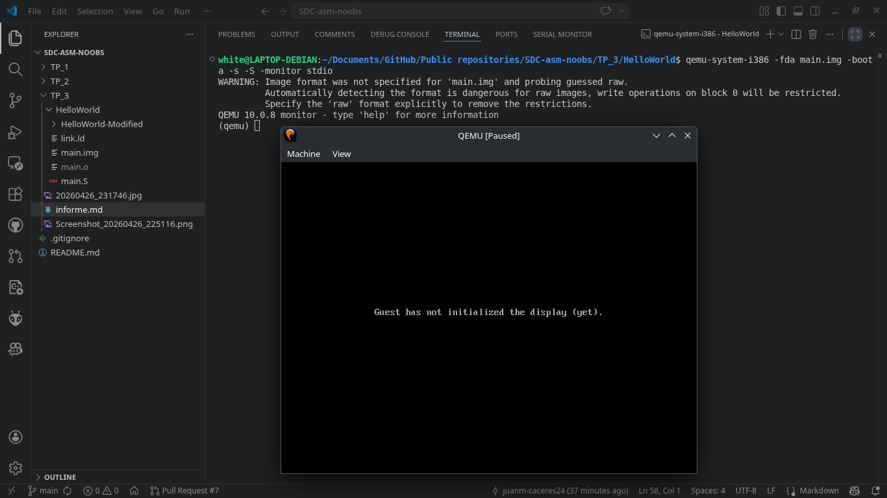
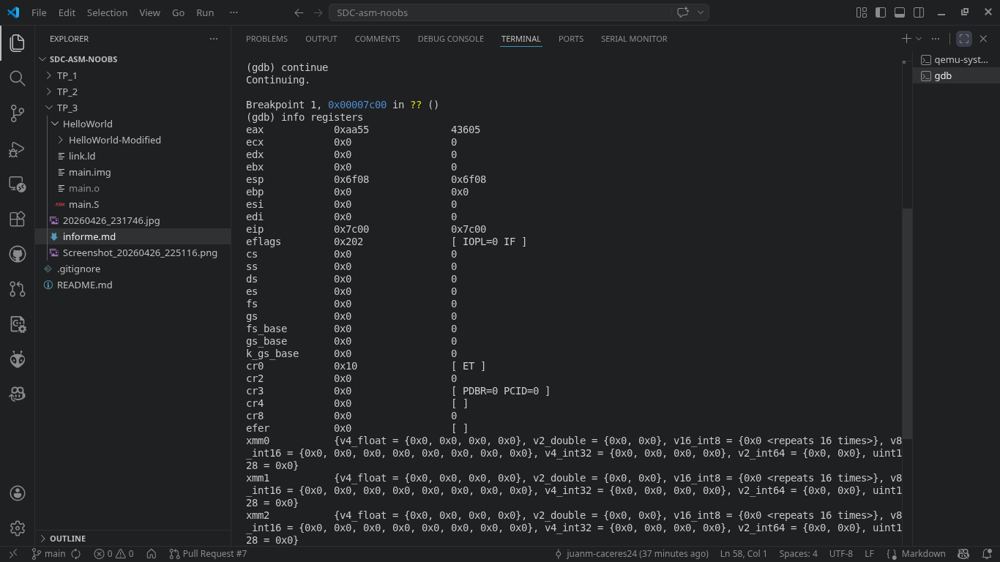
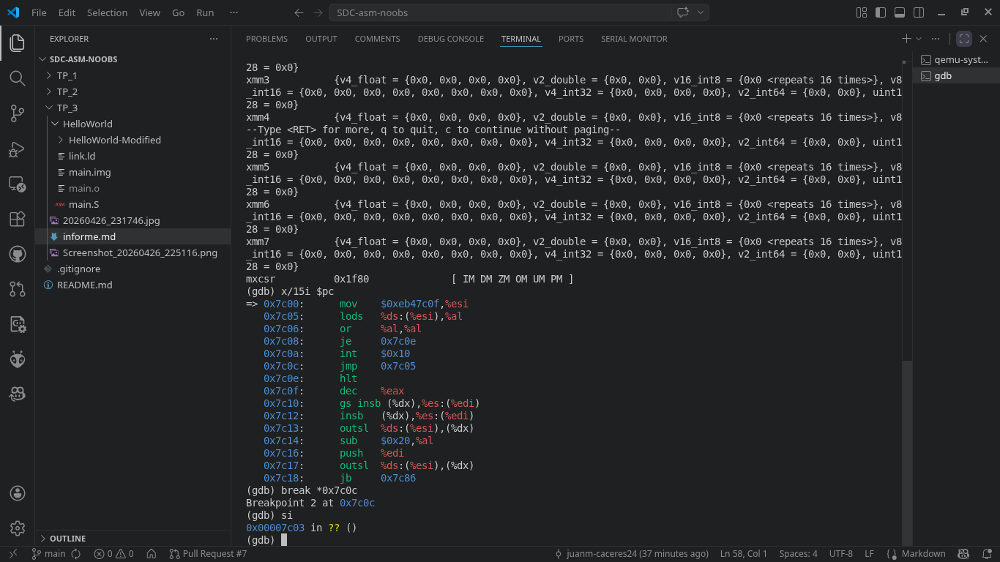
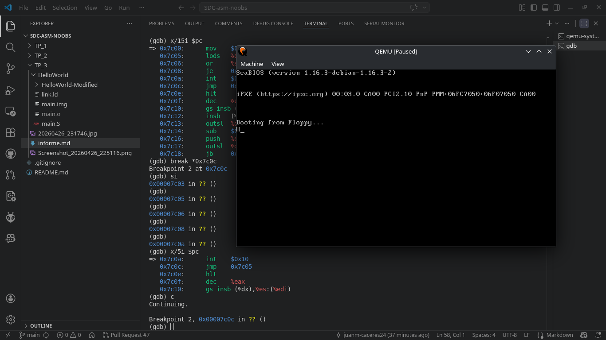

# Trabajo Practico N°3

## Calculadora de Indices

**Materia:** Sistemas de Computación  
**Grupo:** asm_noobs  
**Integrantes:** [Fabian Nicolas Hidalgo] · [Juan Manuel Caceres] · [Agustin Alvarez]  
**Repositorio:** [Github](https://github.com/Nick07242000/SDC-asm-noobs/blob/main/TP_3)

---

### Desafio: BIOS, UEFI y Coreboot

...

---

### Desafio: Linker y Hello World Bare-Metal

**¿Qué es un linker y qué hace?**
El linker (enlazador), como `ld` de GNU, es la herramienta que realiza el paso final en la creación de un binario. Su función es combinar múltiples archivos objeto y archivos de archivo (.a), relocalizar sus datos y resolver las referencias a símbolos (como etiquetas de funciones o variables). El linker se guía por un "Linker Script" que describe cómo deben organizarse las secciones de código y datos en el archivo de salida final para que el hardware pueda interpretarlas correctamente.

**¿Qué es la dirección que aparece en el script del linker? ¿Por qué es necesaria?**
En el script, el símbolo `.` representa el "location counter" (contador de ubicación). Al asignarle el valor `0x7c00`, le estamos indicando al linker que la dirección virtual de memoria (VMA) de nuestro código comienza exactamente ahí. 

Esta dirección es crítica debido a una decisión de diseño que data de la IBM PC 5150 (1981). Los desarrolladores de la BIOS eligieron `0x7c00` porque, en máquinas que entonces tenían solo 32KB de RAM, esta dirección permitía cargar el sector de arranque lo suficientemente alto para no sobrescribir la Tabla de Vectores de Interrupción (IVT) en la parte baja, pero dejando espacio suficiente arriba para que el sistema operativo cargara su propio código y manejara su pila (stack) sin colisiones. Si no definimos esto en el linker, las referencias a datos dentro de nuestro ensamblador serían calculadas desde la dirección `0x0`, y el programa fallaría al intentar leer variables una vez cargado en la RAM real.

**Comparación de la salida de objdump con hd.**
La comparación nos permite ver el programa desde dos perspectivas:
* **objdump -S:** Nos muestra la vista lógica, relacionando las instrucciones de ensamblador con sus direcciones de memoria y los opcodes resultantes (por ejemplo, ver que la instrucción `hlt` se traduce al byte `f4`).
* **hd (hexdump):** Nos muestra la vista física del archivo `.img`. Aquí verificamos que los bytes estén en el orden exacto y que la firma de arranque `55 AA` ocupe los bytes 511 y 512 del sector. Al contrastarlos, confirmamos que el linker colocó cada sección en el offset correcto para que la BIOS lo reconozca como un disco booteable.

**¿Para qué se utiliza la opción --oformat binary en el linker?**
Se utiliza para generar un archivo binario "plano" (flat binary). Por defecto, los linkers modernos generan archivos en formato ELF o PE, que contienen encabezados complejos con metadatos para el sistema operativo. En un entorno bare-metal, no hay un sistema operativo para leer esos encabezados; el procesador simplemente empieza a ejecutar bytes uno tras otro. La opción `--oformat binary` elimina toda esa estructura extra y deja únicamente las instrucciones de máquina puras, que es lo único que el CPU puede procesar en modo real.

**Grabar la imagen en un pendrive y probarla en una PC**

Para llevar nuestro código bare-metal a un entorno físico, el primer paso es compilar y enlazar el código fuente. Desde nuestra terminal en Linux, ejecutamos la siguiente secuencia:

* **Ensamblado:** `as -g -o main.o main.S`
    Este comando utiliza el GNU Assembler para traducir nuestro código fuente (`main.S`) a código objeto (`main.o`), incluyendo información de depuración mediante la bandera `-g`.
* **Enlazado:** `ld --oformat binary -o main.img -T link.ld main.o`
    El GNU Linker toma el archivo objeto y, aplicando las reglas matemáticas de nuestro script `link.ld`, ubica el código en la dirección de memoria correcta (`0x7c00`), generando un archivo binario puro (`main.img`).

Una vez obtenida la imagen booteable, procedemos a transferirla al pendrive. Es fundamental desmontar la unidad previamente para evitar conflictos con el sistema operativo:

* **Desmontaje:** `sudo umount /dev/sdb1`
* **Escritura a bajo nivel:** `sudo dd if=main.img of=/dev/sdb status=progress`
    La herramienta `dd` toma nuestra imagen y escribe sus bytes exactos directamente en el primer sector físico del USB (`/dev/sdb`), ignorando cualquier sistema de archivos previo y convirtiendo al dispositivo en un disco de arranque válido (MBR).

Finalmente, procedimos a probar el pendrive booteable. Para sortear las restricciones del firmware UEFI de las notebooks modernas, utilizamos una computadora de escritorio. Las placas madre de escritorio suelen ofrecer módulos CSM (Compatibility Support Module) más robustos, permitiendo emular a la perfección el arranque *Legacy* de 16 bits. 

Al encender el equipo y seleccionar el pendrive en el menú de arranque, el procesador inició en modo real, ejecutó nuestras instrucciones nativamente y logró imprimir la cadena de texto con éxito antes de entrar en un estado de detención controlada (`hlt`).

---

### Depuracion con GDB + QEMU

Para iniciar la sesión de depuración en frío, lanzamos el emulador utilizando el siguiente comando:
* `qemu-system-i386 -fda main.img -boot a -s -S -monitor stdio`: Inicia la máquina virtual cargando nuestra imagen, pero congela la ejecución de la CPU antes de la primera instrucción (`-S`) y abre un servidor local (`-s`) a la espera de que nos conectemos.

Desde una terminal secundaria iniciamos GDB y ejecutamos la siguiente secuencia para tomar el control del hardware emulado:
* `target remote localhost:1234`: Establece la conexión directa con la sesión de QEMU.
* `set architecture i8086`: Fuerza al depurador a interpretar la memoria y los registros en modo real de 16 bits, evitando errores de decodificación.
* `break *0x7c00`: Fija un punto de interrupción exactamente en la dirección física donde la BIOS carga el MBR.
* `continue`: Permite que la BIOS ejecute su rutina de inicio normal y nos devuelva el control al llegar a nuestro código.
* `info registers`: Imprime el estado interno del procesador. Aquí confirmamos que el registro `eip` (Instruction Pointer) apuntaba a `0x7c00`.

Para evitar que el depurador ingrese a leer las rutinas internas de la placa madre al momento de imprimir texto, necesitamos identificar nuestras instrucciones físicas en memoria:
* `x/15i $pc`: Examina y traduce a lenguaje ensamblador las próximas 15 instrucciones a partir del Program Counter actual. Esto nos permitió ubicar la interrupción (`int $0x10`) en `0x7c0a`.
* `break *0x7c0c`: Establece un segundo punto de interrupción en la instrucción inmediatamente posterior al llamado de video (`jmp 0x7c05`), creando una barrera de contención.

Con la zona de interrupción delimitada, controlamos el avance del procesador alternando dos comandos clave:
* `si` (step instruction): Ejecuta el código avanzando estrictamente una instrucción de ensamblador por vez, permitiendo analizar la carga de los registros.
* `c` (continue): Al ubicarnos justo sobre la instrucción `int $0x10`, ejecutamos este comando para que la BIOS tome el control a velocidad normal, dibuje el carácter "H" en pantalla y se detenga inmediatamente al chocar con nuestro segundo breakpoint, listos para la siguiente vuelta del bucle.

---

### Desafio: Modo Protegido

...

---
