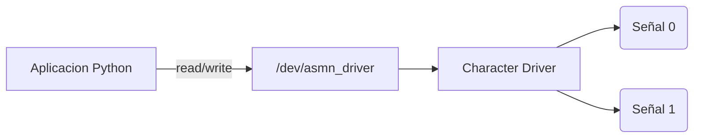

# Trabajo Practico N°5

## Character Device Driver

**Materia:** Sistemas de Computacion  
**Grupo:** asm_noobs  
**Integrantes:** [Fabian Nicolas Hidalgo] · [Juan Manuel Caceres] · [Agustin Alvarez]  
**Repositorio:** [Github](https://github.com/Nick07242000/SDC-asm-noobs/blob/main/TP_5)

---

### Introduccion

En este trabajo practico se desarrolla un Character Device Driver (CDD) para Linux capaz de sensar dos señales externas.

Este las muestrea cada un segundo, y permite que una aplicacion de usuario seleccione cual señal leer.

Finalmente grafica la señal seleccionada en funcion del tiempo.

---

### Objetivos

Se va a diseñar e implementar un Character Device Driver capaz de adquirir dos señales y exponerlas a una aplicacion de usuario.

El objetivo principal es comprender la arquitectura de drivers Linux, la comunicacion entre User Space y el Kernel Space, el uso de CDDs, el manejo de `/dev`, el uso de timers en kernel y el intercambio de datos mediante `read()` y `write()`.

---

### Descripcion del Sistema

El sistema desarrollado se divide en dos partes:

#### Kernel Space

Implementado mediante un Character Device Driver, que tiene como responsabilidad:

- Generar dos señales.
- Actualizarlas cada segundo.
- Administrar el canal seleccionado.
- Entregar datos a user-space.

#### User Space

Aplicacion Python encargada de:

- Leer datos desde `/dev/asmn_driver`
- Graficar la señal.
- Permitir cambio de canal.
- Resetear el grafico.



---

### Desarrollo del Driver

#### Modulo Basico

El primer paso fue crear un modulo basico del kernel.

En Linux, todo modulo posee dos funciones principales, una de inicializacion, y una de finalizacion.

La de inicializacion se ejecuta cuando el modulo es cargado con `insmod`, mientras que la de finalizacion se ejecuta cuando el modulo es removido utilizando `rmmod`.

Las macros `module_init` y `module_exit` permiten registrar estas funciones dentro del kernel.

```c
#include <linux/module.h>
#include <linux/kernel.h>

static int __init asmn_init(void)
{
    printk(KERN_INFO "ASMN Driver loaded\n");
    return 0;
}

static void __exit asmn_exit(void)
{
    printk(KERN_INFO "ASMN Driver unloaded\n");
}

module_init(asmn_init);
module_exit(asmn_exit);

MODULE_LICENSE("GPL");
MODULE_AUTHOR("asm_noobs");
MODULE_DESCRIPTION("TP5 Character Device Driver");
```

Inicialmente el modulo solamente imprimía mensajes utilizando `printk()` para verificar correctamente la carga del modulo, la descarga y la visualizacion de mensajes en `dmesg`.

Para validar cada etapa del modulo se genero un makefile y un script para permitirnos visualizar la carga, descarga y ejecucion del modulo.


Este módulo solo es código cargado en kernel-space que no existe /dev, nadie puede usarlo y no hay archivo.

#### Character Device Driver

Una vez validado el modulo basico el siguiente paso fue convertirlo en un Character Device Driver. El CDD es la interfaz que Linux usa para hablar con el módulo.

Para que Linux pueda asociar un archivo dentro de `/dev` con nuestro driver fue necesario registrar un numero major,minor.

El numero major identifica al driver dentro del kernel mientras que el minor identifica una instancia específica del dispositivo.

Para esto se utilizó `alloc_chrdev_region()` porque permite que el kernel asigne automáticamente un major libre evitando conflictos con otros dispositivos del sistema.

Aqui le estamos diciendo al kernel que este módulo sabe manejar un dispositivo de caracteres.

Al codigo incorporamos la estructura `struct cdev` la cual representa internamente el dispositivo de caracteres dentro del kernel.

Por medio de `cdev_init()` y `cdev_add()` asociamos las operaciones del driver con el dispositivo recién registrado.

```c
#include <linux/module.h>
#include <linux/kernel.h>
#include <linux/cdev.h>
#include <linux/cdev.h>

#define DEVICE_NAME "asmn_driver"

static dev_t dev_num;
static struct cdev asmn_cdev;

static int __init asmn_init(void)
{
    alloc_chrdev_region(&dev_num, 0, 1, DEVICE_NAME);

    cdev_init(&asmn_cdev, NULL);
    cdev_add(&asmn_cdev, dev_num, 1);

    printk(KERN_INFO "ASMN Driver registered. Major=%d\n", MAJOR(dev_num));

    return 0;
}

static void __exit asmn_exit(void)
{
    cdev_del(&asmn_cdev);

    unregister_chrdev_region(dev_num, 1);

    printk(KERN_INFO "ASMN Driver unloaded\n");
}

module_init(asmn_init);
module_exit(asmn_exit);

MODULE_LICENSE("GPL");
MODULE_AUTHOR("asm_noobs");
MODULE_DESCRIPTION("TP5 Character Device Driver");
```

Hasta este punto el módulo existía dentro del kernel pero Linux todavía no sabía cómo interactuar con él como dispositivo.


Inicialmente generamos el archivo asociado dentro de dev de forma manual dentro del script:

```bash
sudo mknod ${DEVICE_NAME} c ${MAJOR} 0
sudo chmod 666 ${DEVICE_NAME}
```

#### File Operations

Una vez registrado el dispositivo se definio qué acciones realizaría el driver cuando un programa de usuario intentara interactuar con él.

En Linux todas las operaciones de un Character Device se describen mediante la estructura `struct file_operations` que funciona como una tabla de funciones que el kernel invoca automáticamente cuando ocurre alguna operación sobre el archivo del dispositivo.

Implementamos las operaciones minimas necesarias `open`, `release`, `read` y `write` para la comunicación user-space y kernel-space.

La estructura quedó definida como:

```C
static struct file_operations fops = {
    .owner = THIS_MODULE,
    .open = asmn_open,
    .release = asmn_release,
    .read = asmn_read,
    .write = asmn_write,
};
```

A partir de aquí cualquier programa que accediera a `/dev/asmn_driver` ejecutaría automáticamente las funciones correspondientes del módulo.

Por ejemplo `cat /dev/asmn_driver` genera internamente `open()`, `read()` y `release()`.


#### Generacion de Señales

Una vez establecida la comunicación básica el siguiente objetivo fue incorporar las señales requeridas por el TP.

En lugar de utilizar hardware real desde el comienzo se decidió generar señales simuladas dentro del kernel.

Se implementaron dos señales para disponer de dos fuentes de datos diferentes sobre las cuales trabajar.
- Señal 0 : Una señal periódica creciente simulando una onda.
- Señal 1 : Una señal aleatoria utilizando `prandom_u32()`.

```C
static int signal_0 = 0;
static int signal_1 = 0;

static int counter = 0;

static void generate_signals(void)
{
    signal_0 = (counter % 20) * 5;
    signal_1 = get_random_u32() % 100;
    counter++;
}
```

Asi podemos ver el valor generado por la señal simulada:


Para que las señales fueran muestreadas cada 1 segundo se implementó un timer del kernel utilizando `struct timer_list`.

El timer fue configurado para ejecutar periódicamente la generacion de las señales.

Posteriormente el timer se rearmaba utilizando `mod_timer()`.

```C
static void timer_callback(struct timer_list *t)
{
    generate_signals();
    printk(KERN_INFO "Signal0=%d Signal1=%d\n", signal_0, signal_1);
    mod_timer(&asmn_timer, jiffies + msecs_to_jiffies(1000));
}

static int __init asmn_init(void)
{
    alloc_chrdev_region(&dev_num, 0, 1, DEVICE_NAME);

    cdev_init(&asmn_cdev, &fops);
    cdev_add(&asmn_cdev, dev_num, 1);

    timer_setup(&asmn_timer, timer_callback, 0);
    mod_timer(&asmn_timer, jiffies + msecs_to_jiffies(1000));

    printk(KERN_INFO "ASMN Driver registered. Major=%d\n", MAJOR(dev_num));

    return 0;
}
```

Esto permitió que el driver funcionara de manera autónoma generando nuevas muestras periódicamente sin intervención de la aplicación de usuario.


#### Lectura de Señales

Una vez que el driver ya generaba señales periódicamente el siguiente paso fue permitir que un programa de usuario pudiera leerlas.

Para esto se completo la funcion `asmn_read()` para identificar qué canal estaba seleccionado, obtener el valor correspondiente, formatearlo como texto y copiarlo a user-space.

```C
static ssize_t asmn_read(struct file *file, char __user *buf, size_t len, loff_t *off)
{
    char message[64];

    int value;
    int bytes;

    if (*off > 0) return 0;

    if (selected_channel == 0) value = signal_0;
    else value = signal_1;

    bytes = sprintf(message, "%d,%d\n", counter, value);

    if (copy_to_user(buf, message, bytes)) return -EFAULT;

    *off += bytes;

    return bytes;
}
```

Vemos ahora como haciendo `cat /dev/asmn_driver` en el paso doce de validacion podemos leer los valores sensados:


La copia de memoria se realizó utilizando `copy_to_user()` porque el kernel no puede acceder directamente a memoria de usuario de manera segura.

Durante esta etapa apareció un problema importante donde `cat` realizaba múltiples lecturas sucesivas porque el kernel esperaba recibir un EOF.

La solución consistió en utilizar `if (*off > 0) return 0;` para indicar correctamente el final de archivo luego de una lectura completa.

#### Seleccion de Canal

Para permitir que la aplicación seleccionara cuál señal leer se completo la implementacion de `asmn_write()`.

La idea fue utilizar el archivo `/dev/asmn_driver` también como mecanismo de configuración.

Se utilizo `copy_from_user()` para copiar el dato enviado desde user-space hacia memoria del kernel, y en baseo a eso actualizamos `selected_channel`. 

```C
static ssize_t asmn_write(struct file *file, const char __user *buf, size_t len, loff_t *off)
{
    char kbuf[8];

    if (copy_from_user(kbuf, buf, len))return -EFAULT;

    kbuf[len] = '\0';

    if (kbuf[0] == '0') selected_channel = 0;
    else if (kbuf[0] == '1')selected_channel = 1;

    printk(KERN_INFO "Selected channel: %d\n", selected_channel);

    return len;
}
```

Aqui logramos una comunicación bidireccional entre user-space y kernel.

Ahora con `echo 0 | sudo tee /dev/asmn_driver` podemos seleccionar el canal cero y con `echo 1 | sudo tee /dev/asmn_driver` podemos seleccionar el canal uno.


#### Generacion Automatica de /dev

Hasta ahora el dispositivo existía dentro del kernel, pero todavía no aparecía automáticamente dentro de /dev, esto lo realizabamos de forma manual en el script:

```bash
echo "============================================================"
echo " STEP 5.1 - Creating device node manually"
echo "============================================================"

MAJOR=$(cat /proc/devices | grep ${MODULE_NAME} | awk '{print $1}')

if [ -z "${MAJOR}" ]; then
    echo "[ERROR] Could not find major number"
    exit 1
fi

if [ ! -e ${DEVICE_NAME} ]; then
    sudo mknod ${DEVICE_NAME} c ${MAJOR} 0
    sudo chmod 666 ${DEVICE_NAME}
    echo
    echo "[OK] Device node created"
else
    echo
    echo "[OK] Device node already exists"
fi
```

Para automatizar esto se utilizo `class_create()` y `device_create()` que registran el dispositivo dentro de `sysfs` permitiendo que `udev` cree automáticamente `/dev/asmn_driver`.

```C
static int __init asmn_init(void)
{
    alloc_chrdev_region(&dev_num, 0, 1, DEVICE_NAME);

    cdev_init(&asmn_cdev, &fops);
    cdev_add(&asmn_cdev, dev_num, 1);

    asmn_class = class_create("asmn_class");
    device_create(asmn_class, NULL, dev_num, NULL, DEVICE_NAME);

    timer_setup(&asmn_timer, timer_callback, 0);
    mod_timer(&asmn_timer, jiffies + msecs_to_jiffies(1000));

    printk(KERN_INFO "ASMN Driver registered. Major=%d\n", MAJOR(dev_num));

    return 0;
}
```

Esto tiene una correspondencia para destruir el dispositivo al quitar el modulo:

```C
static void __exit asmn_exit(void)
{
    del_timer(&asmn_timer);

    device_destroy(asmn_class, dev_num);

    class_destroy(asmn_class);

    cdev_del(&asmn_cdev);

    unregister_chrdev_region(dev_num, 1);

    printk(KERN_INFO "ASMN Driver unloaded\n");
}
```

Ante una primera ejecucion nos encontramos con falta de permisos:


Esto es porque eliminamos `sudo chmod 666 ${DEVICE_NAME}` del script que otorgaba los permisos de lectura y escritura.

Para resolver esto desde codigo definimos un callback para cargar en `devnode` de la clase creada, que otorgue estos permisos:

```C
static char *asmn_devnode(const struct device *dev, umode_t *mode)
{
    if (mode) *mode = 0666;
    return NULL;
}

static int __init asmn_init(void)
{
    ...
    asmn_class = class_create("asmn_class");
    asmn_class->devnode = asmn_devnode;
    ...
}
```

Con este ajuste al ejecutar podemos ver como se genera automaticamente el archivo dentro de `dev` y se ejecutan todas las funcionalidades:


Asi se integraron todas las partes desarrolladas, el módulo del kernel, el registro del device, las operaciones del dispositivo, el timer, la generación de señales, la lectura y escritura, y la creación automática de `/dev`.

El resultado final fue un Character Device Driver completamente funcional capaz de generar dos señales, muestrearlas periódicamente, permitir selección dinámica de canal y entregar datos a aplicaciones de usuario mediante `/dev/asmn_driver`.

---

### Aplicación y Visualización

Se desarrolló una aplicación en Python para interactuar con el dispositivo `/dev/asmn_driver` y visualizar en tiempo real las señales generadas por el Character Device Driver.

Para la interfaz gráfica se utilizó la biblioteca `Matplotlib`, la cual permite seleccionar una de las dos señales disponibles mediante botones y representar su evolución en función del tiempo.

Cuando el usuario presiona uno de los botones, se invoca a la función `set_channel()`, que escribe el valor correspondiente (0 o 1) en el archivo `/dev/asmn_driver`.Esto provoca que el driver cambie el canal de medición seleccionado y reinicia los datos almacenados para comenzar una nueva visualización.

La lectura de datos se realiza abriendo periódicamente el dispositivo con `read_device()` y obteniendo una cadena con el formato `contador:valor`, donde el contador representa el tiempo transcurrido y el valor corresponde a la medición de la señal seleccionada.

Mediante la función `FuncAnimation`, la aplicación consulta el driver cada 500 ms y actualiza automáticamente el gráfico, sin repetir muestras.

#### Ejecución de app.py

Para la ejecucion de `app.py` utilizamos `make run`.
Al ejecutar este comando se realizan automáticamente las siguientes acciones:

- Se compila el módulo del kernel.
- Se elimina una versión previa del módulo (si estaba cargada).
- Se carga el módulo mediante `insmod`.
- Se ejecuta la aplicación Python.
- La aplicación comienza a comunicarse con el dispositivo /dev/asmn_driver y muestra las señales en tiempo real.

> [!NOTE]

Debido a que la aplicación utiliza la biblioteca `Matplotlib`, es necesario instalarla previamente:
```bash
sudo apt install python3-matplotlib
```

Al ejecutar podemos observar la visualizacion de la señal lineal:


E incluso podemos cambiar para visualizar la señal aleatoria:


---

### Raspberry Pi
 
Para esta etapa de la experiencia el foco es la compilacion cruzada del driver para la ejecucion de la misma desde una Raspberry PI.

Todo el código es escrito en la PC host, y con la ayuda de un Makefile compilamos el código apuntando a la arquitectura de la Raspberry.

Una vez generados los binarios estos seran enviados a la Raspberry Pi a través de SSH.


Vamos a utilizar QEMU para emular una Raspberry PI ante la falta del hardware fisico real. Para esto vamos a utilizar los siguientes componentes:

- Imagen del SO: Raspberry Pi OS Lite arm64 oficial. Usamos la versión Lite porque no necesitamos solo SSH, Python y el kernel.
- Máquina QEMU: `-machine raspi3b` con CPU Cortex-A72.
- Kernel y DTB: Extraidos directamente de la partición boot del .img descargado.
- Cross-toolchain: `gcc-aarch64-linux-gnu` en el host. Para ARM64 usamos el toolchain `aarch64-linux-gnu` que corre en el host x86-64 pero produce binarios ARM64.
- Kernel headers: Repo oficial `raspberrypi/linux` rama `rpi-6.12.y` necesarios para compilar el módulo `.ko` contra el mismo kernel que corre la VM.

#### QEMU VM 

Lo primero que debiamos hacer era montar una QEMU con Raspberry Pi. Para eso descargamos la imagen Lite arm64:

```bash
wget https://downloads.raspberrypi.com/raspios_lite_arm64/images/raspios_lite_arm64-2025-05-13/2025-05-13-raspios-bookworm-arm64-lite.img.xz
xz -d 2025-05-13-raspios-bookworm-arm64-lite.img.xz
```

Agrandamos la imagen para tener espacio de trabajo:

```bash
qemu-img resize -f raw 2025-05-13-raspios-bookworm-arm64-lite.img +2G
```

Extraemos kernel8.img y DTB de la partición boot:

```bash
sudo losetup -P -f --show 2025-05-13-raspios-bookworm-arm64-lite.img
mkdir -p mnt/boot
sudo mount /dev/loop20p1 mnt/boot
```

Luego de ejecutar esos comandos tenemos estos archivos disponibles dentro de `mnt/boot`, los cuales extraemos:

```bash
cp mnt/boot/kernel8.img .
cp mnt/boot/bcm2710-rpi-3-b-plus.dtb .
```

Habilitamos SSH en primer boot (un archivo vacío activa el servicio):

```bash
sudo touch mnt/boot/ssh
```

Creamos un usuario `asm_noobs` con contraseña `1234`:

```bash
echo "asm_noobs:$(echo '1234' | openssl passwd -6 -stdin)" | sudo tee mnt/boot/userconf.txt
```

Y desmontamos la imagen despues de extraer lo necesario:

```bash
sudo umount mnt/boot
sudo losetup -D /dev/loop20
```

En resumen se extrae `kernel8.img` y `bcm2710-rpi-3-b-plus.dtb` de la partición boot y se habilita SSH creando el archivo `ssh` y el archivo `userconf.txt` con el hash de la contraseña.

Procedemos a levantar QEMU con el comando:

```bash
qemu-system-aarch64 \
  -machine raspi3b \
  -cpu cortex-a53 \
  -m 1G -smp 4 \
  -kernel kernel8.img \
  -dtb bcm2710-rpi-3-b-plus.dtb \
  -drive format=raw,file=2025-05-13-raspios-bookworm-arm64-lite.img \
  -append "rw earlyprintk loglevel=8 console=ttyAMA1,115200 \
           root=/dev/mmcblk0p2 rootfstype=ext4 \
           dwc_otg.lpm_enable=0 rootdelay=1 systemd.log_level=debug \
           systemd.log_target=console systemd.mask=userconfig.service" \
  -netdev user,id=net0,hostfwd=tcp::2222-:22,hostfwd=tcp::8080-:8080 \
  -device usb-net,netdev=net0 \
  -nographic
```

Al correrla encontramos que el sistema quedaba colgado en `userconfig.service` y `SSH` rechazaba la conexión.

Encontramos una serie de problemas:
- El servicio de primer arranque de Raspberry Pi OS que procesa `userconf.txt` se cuelga indefinidamente bajo emulación QEMU. Esto se debe a que las utilidades PAM/shadow hacen syscalls que el emulador `aarch64` no maneja correctamente (especialmente llamadas relacionadas con entropía/random).
- El comando original con pipe no producía un hash `$6$` válido cuando se ejecutaba dentro de subshells. El hash resultante carecía del prefijo de algoritmo.
- Al hacer `chown` desde el host el directorio quedó asignado al usuario del host en lugar del usuario de la imagen. Aunque comparten uid el nombre visible causaba confusión y PAM rechazaba el login.

Para esto ejecutamos una solucion disponible en `userconfig.sh` que:
- Monta la imagen
- Habilita SSH
- Deshabilita userconfig.service
- Crea el usuario directamente en rootfs
- Genera hash correcto y escribe en shadow
- Corrige ownership del home
- Desmonta limpiamente

Solucionado eso logramos levantar la VM y conectarnos por SSH:


#### Compilacion Cruzada

Ahora el objetivo es compilar en Ubuntu x86_64 un módulo de kernel `asmn_driver.ko` que pudiera cargarse correctamente en una Raspberry Pi que ejecutaba exactamente:

> Linux version 6.12.25+rpt-rpi-v8
> #1 SMP PREEMPT Debian 1:6.12.25-1+rpt1 (2025-04-30)

El desafío principal era que el módulo debía ser compatible con ese kernel específico incluyendo:
- misma versión (UTS_RELEASE)
- misma configuración (.config)
- mismos símbolos exportados (Module.symvers)
- mismas opciones de compilación
- misma variante Raspberry Pi (rpt-rpi-v8)

Inicialmente intentamos clonar el repositorio oficial de Raspberry Pi:

```bash
git clone --depth=1 --branch rpi-6.12.y https://github.com/raspberrypi/linux.git
```

La idea era utilizar directamente el árbol fuente oficial pero rápidamente encontramos un problema.

El árbol obtenido generaba `#define UTS_RELEASE "6.12.92-v8+"` mientras que el kernel real de la Raspberry ejecutaba `#define UTS_RELEASE "6.12.25+rpt-rpi-v8"`.

Por lo tanto no era exactamente el mismo kernel, no coincidían los paquetes Debian de Raspberry Pi y existía riesgo de incompatibilidad de símbolos.

Entonces comenzamos a extraer información directamente desde la Raspberry.


Esto nos dio el objetivo exacto a reproducir.

Entonces procedimos a copiar los paquetes instalados en:

> /usr/src/linux-headers-6.12.25+rpt-common-rpi
> /usr/src/linux-headers-6.12.25+rpt-rpi-v8
> /lib/modules/6.12.25+rpt-rpi-v8

Generando esta estructura de archivos:

```txt
rpi-workspace/
├── 6.12.25+rpt-rpi-v8
├── linux-headers-6.12.25+rpt-common-rpi
└── linux-headers-6.12.25+rpt-rpi-v8
```

Realizamos asi un makefile para compilar con esta estructura:

```makefile
ARCH          := arm64
CROSS_COMPILE := aarch64-linux-gnu-
KDIR          := $(HOME)/rpi-workspace/linux-headers-6.12.25+rpt-rpi-v8

obj-m += asmn_driver.o

all:
	make -C $(KDIR) M=$(PWD) \
	  ARCH=$(ARCH) \
	  CROSS_COMPILE=$(CROSS_COMPILE) \
	  modules

clean:
	make -C $(KDIR) M=$(PWD) \
	  ARCH=$(ARCH) \
	  CROSS_COMPILE=$(CROSS_COMPILE) \
	  clean
```

Pero al intentar compilar obtuvimos `No rule to make target /home/hive/rpi-workspace/headers/common/Makefile`.

Al inspeccionar con `cat linux-headers-6.12.25+rpt-rpi-v8/Makefile` obtuvimos `include /usr/src/linux-headers-6.12.25+rpt-common-rpi/Makefile`.

El paquete de headers estaba diseñado para vivir en `/usr/src/` pero nosotros lo habiamos copiado a `~/rpi-workspace/` por lo que todas las referencias absolutas quedaron inválidas.

Entonces se modificó el Makefile para apuntar a la copia local `include /home/hive/rpi-workspace/linux-headers-6.12.25+rpt-common-rpi/Makefile`.

Procedimos a realizar lo mismo cada vez que obteniamos un error por una referencia de ese tipo, reemplazando la referencia del path de Raspberry por nuestra estructura casera.

Luego al intentar compilar de nuevo encontramos `Kernel configuration is invalid. include/generated/autoconf.h or include/config/auto.conf are missing.`

Verificamos `ls include/config/auto.conf` y `ls include/generated/autoconf.h` observamos que algunos archivos estaban presentes en `linux-headers-6.12.25+rpt-rpi-v8` pero no en `6.12.25+rpt-rpi-v8/build`.

Decidimos copiarlos para reparar la estructura:

```bash
cp -r \
linux-headers-6.12.25+rpt-rpi-v8/include/generated \
6.12.25+rpt-rpi-v8/build/include/

cp -r \
linux-headers-6.12.25+rpt-rpi-v8/include/config \
6.12.25+rpt-rpi-v8/build/include/
```

Luego aparecio `as: unrecognized option '-EL'` que al inspeccionar `which as` obtuvimos `/usr/bin/as` que correspondía al assembler x86_64 mientras que `which aarch64-linux-gnu-as` mostraba `/usr/bin/aarch64-linux-gnu-as`.

La compilación estaba usando GCC cruzado `aarch64-linux-gnu-gcc-12` pero éste estaba invocando incorrectamente el assembler nativo.

Se reinstalo el compilador cruzado con:

```bash
sudo apt install --reinstall \
    gcc-12-aarch64-linux-gnu \
    binutils-aarch64-linux-gnu
```

Donde desaparecio el error `-EL` pero ahora aparecio el error `scripts/basic/fixdep: not found`.

El archivo existia buscando con `ls scripts/basic/fixdep` pero haciendo `file scripts/basic/fixdep` vimos `ELF 64-bit LSB executable, ARM aarch64`.

Los headers copiados desde la Raspberry contenían binarios host compilados para ARM64. Ubuntu intentaba ejecutarlos y fallaba.

Intentando ejecutarlo manualmente `./fixdep` aparecio `Exec format error` confirmado la teoria.

El repositorio Linux clonado previamente sí contenía `scripts/basic/fixdep` y `scripts/mod/modpost` compilados para x86_64.

Verificamos `file scripts/basic/fixdep` que resulto en `ELF 64-bit LSB executable, x86-64`, entonces decidimos copiar esos archivos:

```bash
cp linux/scripts/basic/fixdep linux-headers-6.12.25+rpt-rpi-v8/scripts/basic/
cp linux/scripts/mod/modpost linux-headers-6.12.25+rpt-rpi-v8/scripts/mod/
```

Ahora los ejecutables podían correr en Ubuntu.

Al ejecutar `make` finalmente el modulo compilo y genero `asmn_driver.ko` que procedimos a verificar que la version coincida.


Entonces para compilar utilizamos:
- Desde la Raspberry:
    - .config
    - Module.symvers
    - include/generated/*
    - include/config/*
    - UTS_RELEASE
    - headers específicos Raspberry Pi
- Desde el árbol Linux clonado
    - fixdep
    - modpost
    - herramientas host x86_64

De esta forma se obtuvo un entorno que conservaba exactamente el ABI del kernel de la Raspberry, pero que podía ejecutarse y compilar correctamente sobre Ubuntu x86_64.

#### Ejecucion

Ahora si podemos transferir los archivos a raspberry para ejecutar el CDD y la aplicacion de usuario.

Transferimos el driver compilado a QEMU:


Luego instalamos el mismo y verificamos que este generando "lecturas":


Para visualizar las lecturas generamos un servidor que tomara las lecturas del CDD y las convirtiera en un sitio con human readable user interface.

Al estar funcionando el CDD transferimos el aplicativo web escrito en python y levantamos el servidor dentro de QEMU:


Al servidor nos pudimos conectar desde nuestro host al levantar la VM con `hostfwd=tcp::8080-:8080`:


---

### Módulo Clipboard /proc 

> Para este apartado usamos los recursos de gitlab publicado: `FuentesClipboard`, y se agregaron algunos `printk()` para analizar la lectura y escritura.
> https://gitlab.com/sistemas-de-computacion-unc/device-drivers/-/tree/main/FuentesClipboard?ref_type=heads

Para automatizar las pruebas se desarrolló del mismo modo que CDD el script `validate.sh`. En donde:

- Compilamos el módulo.
- Insertamos el módulo en el kernel.
- Verificamos la presencia de /proc/clipboard.
- Escribimos un mensaje en el clipboard.
- Leemos el contenido almacenado.
- Inspeccionamos los mensajes del kernel mediante dmesg.
- Quitamos el módulo del kernel.
- Limpiamos los archivos generados.

#### Clipboard vs CDD

A diferencia del Character Device Driver desarrollado anteriormente, este módulo no crea una entrada en /dev ni registra un dispositivo de caracteres mediante cdev. En su lugar, crea una entrada virtual dentro del sistema de archivos /proc:

```c
proc_create("clipboard", 0666, NULL, &proc_entry_fops);
```

Por este motivo utiliza la estructura `proc_ops`, recomendada en versiones modernas del kernel para entradas de /proc, en lugar de file_operations.

#### Funcionamiento

Durante la inicialización del módulo se reserva un buffer dinámico de tamaño `PAGE_SIZE` utilizando `vmalloc()`. Este buffer actúa de forma temporal dentro del kernel.

La operación de escritura `clipboard_write()` copia información desde espacio de usuario hacia espacio de kernel mediante `copy_from_user()`, mientras que la operación de lectura `clipboard_read` devuelve el contenido almacenado utilizando `copy_to_user()`.

A diferencia del CDD no implementa operaciones como:
- open()
- release()
- read()
- write()
El módulo clipboard únicamente implementa:
- proc_read()
- proc_write()
Las cuales son suficientes para la funcionalidad requerida.

Finalmente, al descargar el módulo se elimina la entrada `/proc/clipboard` y se libera la memoria reservada mediante `vfree()`, evitando pérdidas de memoria dentro del kernel.


